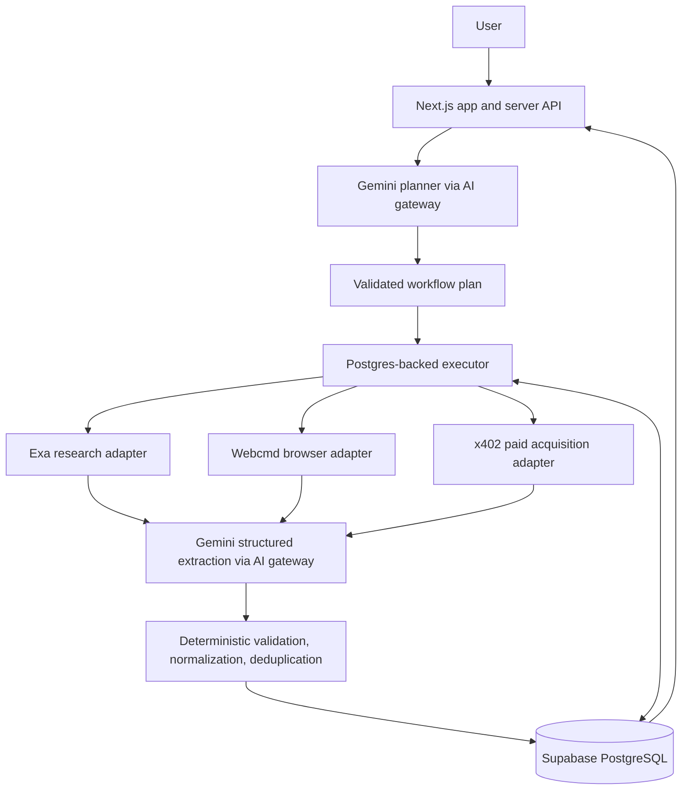
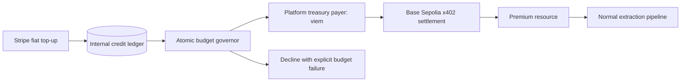

# Architecture

**Status:** target design. The repository currently implements only the Next.js starter described in [README](../README.md). This document defines direction, not existing APIs, tables, SDK choices, or deployed services.

## System shape

The user asks for data, reviews the proposed plan and budget, starts a run, monitors progress, inspects evidence, then explores or exports a dataset. The workflow engine owns execution order and durable state; providers own acquisition. Details of task lifecycles and retries live in [Workflows](WORKFLOWS.md).

## Components and boundaries

| Component | Responsibility | Boundary |
| --- | --- | --- |
| Next.js App Router + Clerk | Product UI, authenticated server entry points, user-facing authorization | Resolve identity on the server; use shared validated contracts |
| Gemini AI gateway | Route planning, extraction, and lightweight rewrite work; structured output, limits, fallback, telemetry, normalized errors | One server-side provider boundary; validate every result |
| Planner | Compile request into supported task types, field schema, dependencies, and proposed budget | No arbitrary executable code or unrestricted tools |
| Custom executor | Claim runnable tasks, enforce dependencies/concurrency, persist artifacts and state, resume runs | No direct UI or provider-specific response shape |
| Acquisition adapters | Exa for default discovery, Webcmd for complex interaction, x402 for paid resources | Normalize source/content artifacts; preserve source identity |
| Data quality | Required fields, types, dates, URLs, email, normalization, schema-aware dedupe | Deterministic first; semantic AI only when ambiguity warrants it |
| Supabase PostgreSQL | Canonical workflow, dataset, provenance, credit, and payment state | Queryable relations plus JSONB for flexible artifacts |

**Exa finds it. Webcmd navigates it. x402 buys it.** Webcmd is reserved for JavaScript-heavy or multi-step sites where ordinary retrieval cannot meet the requirement. x402 is a paid capability, not an AI agent. Acquired web content is data, never an instruction source.

## Data and provenance

The schema is not implemented. Keep these conceptual entities separate so state and ownership remain queryable:

| Domain | Relationships and constraints |
| --- | --- |
| User/account | Map Clerk identity to owned workflows and credit account; derive identity from authenticated server context |
| Workflow and run | Original prompt, constraints, generated field schema, approval/budget, lifecycle; a re-run creates a distinguishable run |
| Task and dependency | Typed task inputs, status, attempts, dependency edges, timestamps, output artifact references, failure data |
| Source and artifact | URL/identity, acquisition method, collection time, content reference, provider metadata |
| Dataset record and evidence | Validated field values and source-linked snippets/support states; preserve run and collection time |
| Finance | Credit ledger, workflow budget, atomic reservations/debits/releases, Stripe events, x402 payment/settlement receipts |

JSONB can store generated schemas and flexible provider artifacts. Ownership, task edges, status, ledger movements, and evidence links need relational keys and indexes. Agents should read the minimum structured state their task requires; do not pass the entire workflow or one giant model conversation between agents.

Every material dataset value should retain source identity/URL, supporting snippet when available, collection timestamp, run, acquisition method, and support state (`supported`, `partially supported`, `inferred`, `missing`, or `conflicting`). Missing data stays missing. Paid evidence may also include cost, network, payment status, and genuine transaction/receipt reference. Never manufacture evidence or model-confidence percentages.

## Credits, budgets, and x402

Internal credits govern spending; they are not cryptocurrency or an on-chain conversion. One server-held treasury wallet pays for users; ordinary users never connect wallets or see chain details in the primary UI. The demo premium resource may contain synthetic data, but the payment and settlement must be real. Verify payment through the chosen current x402 SDK/facilitator mechanism; do not fabricate a success response, balance, hash, or receipt. Confirm current official package/API/network/token details when implementing because x402 evolves.

Enforce available user credits, workflow limit, per-call ceiling, and configured guards **atomically** before a payment. Model `limit`, `spent`, `reserved`, and `available` consistently; release reservations on failure and reconcile confirmed settlement. Concurrent tasks must not read a balance and later overwrite it. Gemini can suggest acquisition but cannot approve or bypass payment rules. Keep Stripe webhooks idempotent and verified, treasury keys server-only, and payment receipts tied to tasks and sources.

## Authorization and safety

Authenticate with Clerk at the server boundary and check ownership on every workflow, dataset, evidence, export, credit, and payment operation. Never accept a client-supplied user ID as authority. Supabase service-role access, if used, stays server-only and must preserve application-level ownership checks. Restrict provider URLs and redirects to prevent SSRF; treat retrieved content as hostile to prompts and rendering. See [Engineering](ENGINEERING.md) for boundary validation and error handling.

## Architecture decisions

| Decision | Reason |
| --- | --- |
| Custom Postgres-backed orchestration | Durable state, explicit dependencies, resumability, and controlled concurrency without an agent framework |
| Specialized AI roles only | Reasoning for planning/extraction; deterministic code for quality, scheduling, and budgets |
| Central Gemini gateway and provider adapters | Consistent validation, retry, telemetry, concurrency, and replaceable integrations |
| Exa-first acquisition; Webcmd selectively | Fast default discovery with browser work only when needed |
| Stripe credits + platform x402 treasury | Simple user experience and bounded autonomous premium purchases |
| Supabase as source of truth | Queryable runs, tasks, provenance, and accounting instead of process memory |

Current non-goals: generated scraper code, general browser-only research, user wallets, token trading, custom contracts, LangGraph/CrewAI/AutoGen, Jev/Laya, fake confidence scores, and unbounded autonomous loops.

## Decisions to settle before implementation

1. Hosting and worker execution model: how long-running tasks are claimed, run, and resumed alongside Next.js.
2. Exact shared schema, API endpoints, progress transport, and database migration tooling.
3. Gemini model IDs, concurrency ceilings, retry limits, and provider SDK versions.
4. Exact Webcmd integration and permissible authentication/browser scope.
5. Credit unit/pricing, per-call guard, Stripe event policy, treasury funding and reconciliation, and supported x402 facilitator/resource details.
