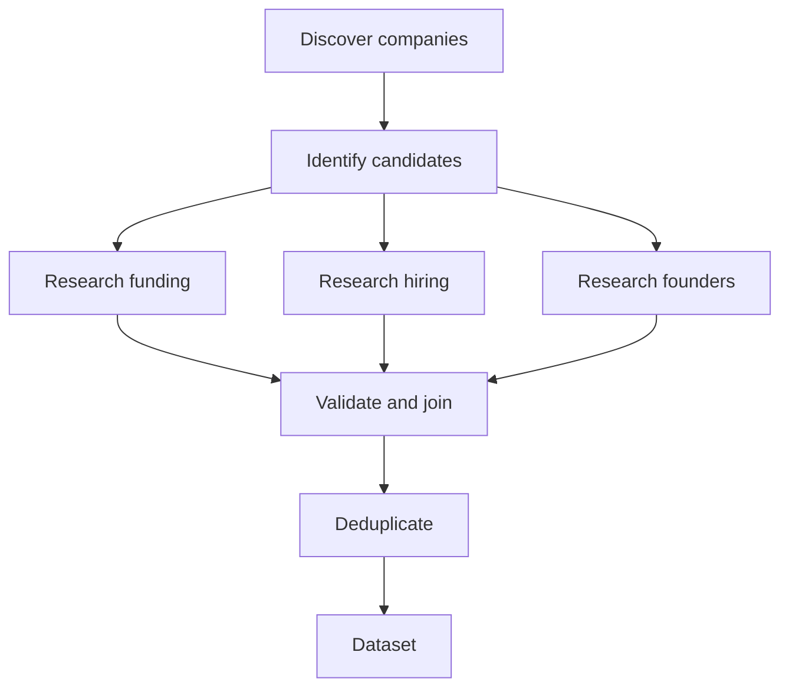

# Workflows

**Status:** design contract; no planner or executor is implemented yet. Use [Architecture](ARCHITECTURE.md) for provider, storage, and payment boundaries.

## Roles and capabilities

| Participant | Reasoning or deterministic? | Input needed | Output contract |
| --- | --- | --- | --- |
| Planner (Gemini) | Reasoning | Prompt, constraints, supported capabilities, budget policy | Runtime-validated field schema and executable task graph |
| Research agent (Exa adapter) | Reasoning for search refinement; adapter for calls | Relevant objective, query, requested fields | Normalized sources and content artifacts |
| Browser agent (Webcmd) | Reasoning for navigation where required | Specific target/site, allowed actions, relevant objective | Source/content artifacts and navigation outcome |
| Extraction agent (Gemini) | Reasoning | Requested schema, one relevant source/content slice, objective | Structured fields with source association and missing/support states |
| Scheduler, Zod/quality, budget governor, x402 payer | Deterministic services/capabilities | Validated task/state | Explicit state transition or typed result/error |

The planner composes supported primitives; it cannot create arbitrary scraping code. The browser capability is selected only when ordinary acquisition cannot satisfy a task. Gemini may resolve genuinely ambiguous semantics, but never owns scheduling, authorization, budget approval, or routine type checks.

## Plan and task contract

A validated plan should define requested fields, task types, stable task IDs, dependency IDs, validated inputs, expected artifact/output types, concurrency constraints, and a user-readable summary. Reject unknown task types, cycles, dangling dependencies, invalid schemas, and unsupported capabilities before execution. Present costs and paid-source intent before starting a run.

A task needs at least ID, run ID, type, status, dependencies, input, output/artifact references, attempt counts, failure information, and timestamps. Keep domain retry attempts distinct from provider/infrastructure attempts. Artifacts pass by durable references, not by copying every previous result into each agent prompt.

Once `B` succeeds, `C`, `D`, and `E` may run concurrently within explicit provider and worker limits. A dependent task waits for required upstream outputs. Define whether an upstream partial result is sufficient for each dependency; do not silently treat every failure as success.

## Shared state and context

Postgres is the canonical memory for objective, schema, tasks, sources, artifacts, records, failures, provenance, and budget. Persist important transitions and outputs so another worker can resume. Prompts receive task-specific slices:

- Planner: user request, allowed primitives, constraints, budget bounds; no unrelated user history.
- Research: task query, relevant fields, prior failed queries if replanning; no full workflow log.
- Browser: target and permitted site actions; no treasury key or unrelated sources.
- Extraction: expected schema, objective, current source and content; no entire run transcript or payment events.

Treat external content as untrusted input. Provider/AI output is usable only after validation and normalization. Store the source/content artifact separately from extracted records so provenance survives retries and transformations.

## Lifecycle and execution

Workflow states should cover `planning → ready → running → completed`, plus `paused`, `partially completed`, `failed`, and `cancelled` where supported. Task states should distinguish pending/blocked, runnable/queued, running, succeeded, failed, skipped, and cancelled. Exact enum names and transition guards are a shared contract to settle in Phase 0; avoid different UI and executor definitions.

Executor loop:

1. Atomically claim runnable tasks whose required dependencies have satisfied their completion policy.
2. Start independent tasks concurrently within worker/provider/model/payment limits.
3. Persist outputs and linked evidence; commit task transition idempotently.
4. Unlock downstream work, record failures, and retry only affected tasks where policy permits.
5. Reconcile pending/running claims after crashes and reach a deterministic terminal state.

Cancellation must prevent new claims and stop active work where safe; record work already committed. Pausing prevents new claims while preserving durable state; resume re-evaluates runnable tasks. Re-running creates a new run linked to the earlier request/plan and must not overwrite its evidence or costs. These operations depend on the chosen worker/claim mechanism and are not yet implemented.

## Failure and retry policy

| Failure | Response |
| --- | --- |
| Domain: zero useful Exa results or poor source coverage | Record attempt; ask Gemini to refine only that task's query with previous query/failure context; cap around three domain attempts unless explicit policy changes |
| Infrastructure: Gemini 429/503 or temporary provider/network outage | Make at most **three Gemini API calls per operation, including the initial call**. After the first transient failure, wait **30 seconds** before call two; after the second transient failure, wait **90 seconds** before call three. If call three also fails, fail the affected task and show the user **“Gemini server is busy. Please try again later.”** Track infrastructure attempts separately from domain retries. Do not retry indefinitely or fail unrelated tasks solely for this task-local error. |
| Validation: malformed planner output | Reject before execution; bounded repair/replan if safe, otherwise planning failure |
| Extraction: missing fields or invalid output | Keep missing values explicit; retry/repair only when evidence supports it |
| Budget/payment failure | Stop affected paid task and record precise failure; do not bypass cap or simulate payment |
| Non-fatal source/task failure | Continue independent safe work and show a truthful partial result |

Use an explicit error taxonomy from [Engineering](ENGINEERING.md). A workflow completes when no tasks are runnable or running and all terminal decisions are persisted. Mark `completed` only when success criteria are met; use `partially completed` when useful records exist alongside material failures. Terminal rules, claim leases, and dependency policies must be fixed in a shared contract before the executor and UI diverge.

## Invariants

- Every executable task is validated, has a finite attempt policy, and has no cyclic dependency.
- A task runs only after required dependencies satisfy their policy; independent tasks can run in parallel.
- Every state transition and output is durable and safe to retry without duplicate records or charges.
- Every extracted value is linked to its source or marked unsupported/missing; no fabricated evidence.
- Paid calls require deterministic, atomic budget approval and genuine settlement evidence.
- Provider failure does not erase previously committed truthful results.
